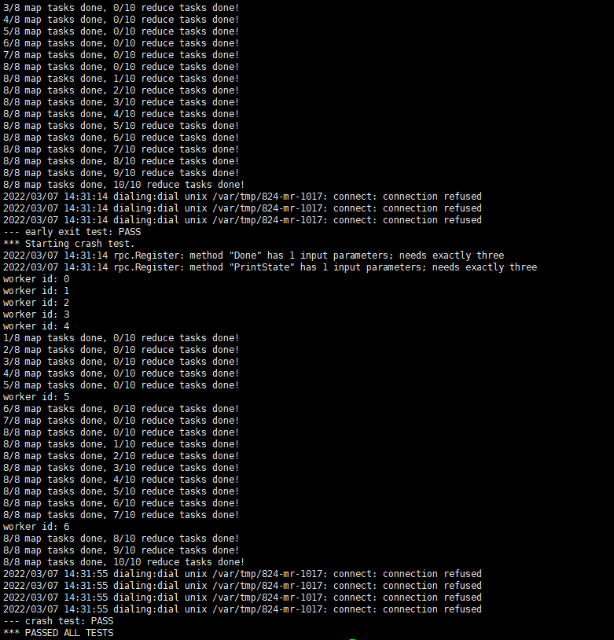

### Coordinator结构

```go
type Coordinator struct {
	WorkerNum int
	WorkerState []int       // -1 - dead, 0 - idle, 1 - working
	WorkerCallTime []int
	MapTaskState []int      // 0 - no allocate, 1 - dealing, 2 - completed
	ReduceTaskState []int   // 0 - no allocate, 1 - dealing, 2 - completed
	Filename []string
	Map2Worker []int
	nReduce int
	Reduce2Worker []int
	mux sync.Mutex
}
```

其中WorkerCallTime在worker每次请求之后都会更新为0，每轮询m.Done()会让WorkerCallTime数组元素加一，代表过去一秒。

Map2Worker数组以及Reduce2Worker数组代表map任务或者reduce任务分配给了哪个worker（记录workerID）。

### 核心函数
- #### coordinator.go

```go
func (c *Coordinator) GetID(args *GetIdArgs, reply *GetIdReply) error {}
```

worker启动后，首先通过rpc调用这个函数来获取自身ID。

```go
func (c *Coordinator) DealFailed(args *DealFailedArgs, reply *DealFailedReply) error
```

当worker处理失败时（如文件读取失败，文件保存失败），放弃任务并通知coordinator，让worker重新为空闲状态。

```go
func (c *Coordinator) GetTask(args *GetTaskArgs, reply *GetTaskReply) error {}
```

空闲的worker每隔一秒轮询对coordinator请求任务，coordinator优先分配map任务，map任务全部完成后分配reduce任务，否则返回空闲状态。
其中请求任务的rpc结构如下：

```go
type GetTaskReply struct {
	TaskType int   // -1 - exit, 0 - idle, 1 - map task, 2 - reduce task
	MapTaskID int
	MapFilename string
	ReduceTaskID int
	ReduceNum int
	MapNum int
}
```

```go
func (c *Coordinator) Done() bool {}
```

由main/mrcoordinator.go可知每隔1秒会执行一次Done()，可以利用这个性质作为计时器，每执行一次Done()让WorkerCallTime数组元素加一，当某个元素大于10，可以认为该worker已经失联，把状态置为dead，并让相关任务重新分配。

- #### worker.go

```go
func ihash(key string) int {}
```

可以根据key生成对应的hash值，对nReduce取模可以得知该key应该分配给哪个reduce任务进行处理。

```go
func Worker(mapf func(string, string) []KeyValue, reducef func(string, []string) string) {}
```

woker主程序。第一次执行会通过GetID()向coordinator获取自身的ID，然后会以一秒的间隔通过函数GetTask(ID, mapf, reducef)轮询向coordinator请求任务。

```go
func DealMap(ID int, reply *GetTaskReply, mapf func(string, string) []KeyValue) {}
```

处理map任务，利用自定义的map函数对文件进行处理，把中间结果以json的格式保存在文件中，文件命名为mr-X-Y，其中X代表map任务的ID，Y代表reduce任务的ID，总共保存X*Y个中间文件。保存完毕后会调用Coordinator.MapSuccess通知coordinator任务完成，让自身的状态重新设置为空闲。（根据MapReduce的论文会对中间结果进行一次排序，以减少reduce时候的排序时间）

```go
func DealReduce(ID int, reply *GetTaskReply, reducef func(string, []string) string) {}
```

处理reduce任务，首先获得reduceID相对应的中间文件名mr-X-reduceID，读取其中的json数据，合并之后进行排序。通过自定义的reduce函数对数据进行处理，完成后结果保存在mr-out-reduceID中。最后调用Coordinator.ReduceSuccess通知coordinator任务完成，让自身的状态重新设置为空闲。

### 测试



### 待优化

保存文件时先写入临时文件（文件名需要随机生成），写入完成后再重命名为对应文件名，可以避免worker crash之后导致文件不可用的情况。

